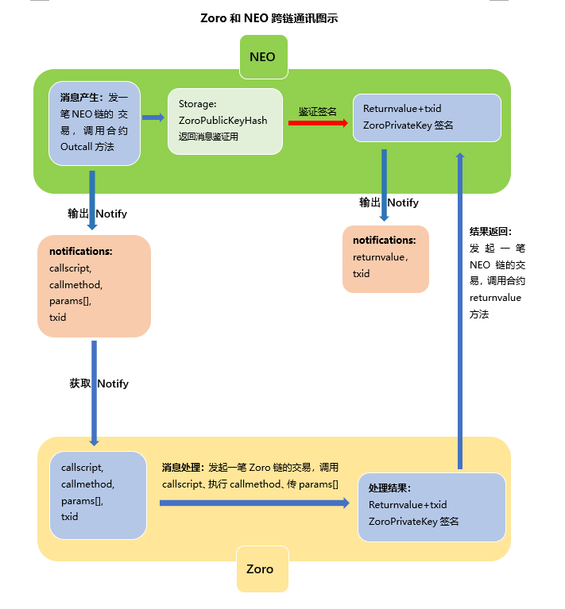

## 设计

* 实现原理： 
 NEO 的 nep5 转账交易可以产生 notify，ZoroChain 可以通过观察 notify 得到 NEO 链上产生的信息；
 ZoroChain 也可以通过构造 NEO 链上的交易将信息带到 NEO 链上。 
* 实现机制： 
     1、在 NEO 上发布支持输出 notify 的智能合约，合约包含接收外部建立通信请求的 call 方法，支持外部传入返回值的 returnvalue 方法等，为了更加安全、需要支持验证签名； 
     2、发送一笔调用 call 方法的交易，此时可以设定返回 returnvalue 的见证人，传入一些请求参数、数据等；      
     3、ZoroChain 根据调用 call 的交易 id 进行监控，获取到 notify，从而得到 NEO 链上 call 合约输出的信息； 
     4、处理完 notify，ZoroChain 向 Neo 链发送具备专用私钥签名的交易，用于向 Neo 链发送 return value 数据。 
     
* 实现过程： 
    1、neo 端交易输出 notify 携带信息，该交易称为 A。 

    2、ZoroChain 捕获到这个信息，在 rootchain 上发起一笔对应的交易，用 A 作为该交易的 ID。
足够的记账节点捕获到该信息，该信息才能上链（这需要额外的机制，不在此处赘述）。 

    3、该交易执行完毕之后，ZoroChain 向 NEO 对应的智能合约发起一笔交易，通知这次调用的返回结果，该交易一样留下独特的 Notify 记号。交易在记账节点执行，每个记账节点都会尝试向 NEO 发起这笔交易（是同一笔交易）。

ZoroChain 捕获到交易 A 对应的 返回结果 notify 后，在 rootchain 上发起一笔对应的调用完成的交易，这个过程可以记为 Rpccall_zoro(txid,state,“xxx”,[]);

对于 NEO 端来说，他会看到两笔 invoke 交易，一笔用于向 zorochain 传递参数（zoro 调用 call 的交易），一笔得到 zorochain 的执行结果（zoro 返回 return value 的交易）。

对于 ZoroChain 端来说，他也会看到两笔交易，一笔传递参数（获得 call 的 notify 后执行处理的交易），一笔显示结果（获得 return value 的 notify 后记录通信完成的交易） 

## 实现
### Demo 说明
#### 外部监测
* 从指定高度开始、读取每个区块，使用 getblock 接口；
* 获取区块中每个 txid 的 notifications，使用 getapplicationlog 接口，没有 notifications 的忽略；
* 解析每条 notifications，只关注 contract 为目标合约 hash 的 notifications；
* 得到目标合约的 notify 的 type 和 value。

#### 外部 call
* 建立通信：发起调用目标合约的一笔交易并签名；调用合约 outcall 方法、交易执行后 callstate=1；
* 根据上一步的 txid、用合约的 getcallstate 方法检查 callstate；这一步用 invokescript；

#### 图示

